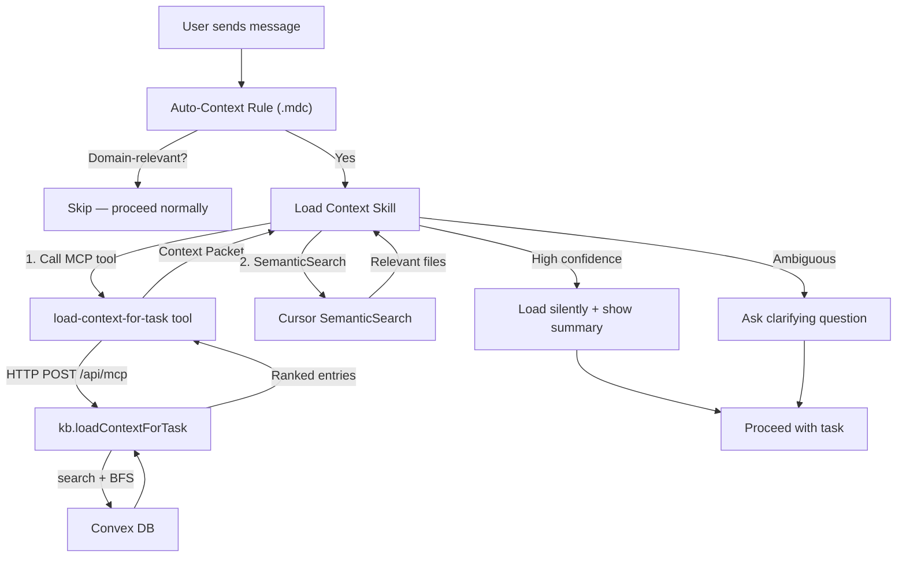

# Build Load Context — Auto-Loading Domain Knowledge

## Architecture




## Files to change

### Layer 1: Convex Backend

- **[convex/kb.ts](convex/kb.ts)** — Add `loadContextForTask` as a new `internalQuery` (~80 lines)
  - Input: `{ workspaceId, taskDescription, maxResults? (default 10), maxHops? (default 2) }`
  - Implementation: call `searchEntries` logic inline with `taskDescription`, take top 3 hits, run BFS traversal (reuse `gatherContext` logic) on each, deduplicate by entry `_id`, rank by hop distance then collection priority (`business-rules` > `glossary` > `decisions` > `features` > `tensions`), cap at `maxResults`, include entry summary (entryId, name, collection slug, description preview from `extractPreview`, `code_paths` from `data` field if present), compute confidence (`high` if 3+ direct hits, `medium` if 1-2, `low` if 0 hits but related found, `none` if empty)
  - Returns: `{ entries: [...], confidence: string, searchTerms: string, totalFound: number }`
- **[convex/http.ts](convex/http.ts)** — Add one line to `QUERIES` map
  - Add `"kb.loadContextForTask": internal.kb.loadContextForTask`

### Layer 2: MCP Server Tool

- **[src/tools/knowledge.ts](src/tools/knowledge.ts)** — Register `load-context-for-task` tool (~70 lines)
  - Follow existing pattern: `server.registerTool("load-context-for-task", { ... }, handler)`
  - Input schema: `taskDescription: z.string()`, `maxResults: z.number().optional()`, `maxHops: z.number().optional()`
  - Handler: call `mcpQuery("kb.loadContextForTask", ...)`, format response as Context Packet markdown
  - Context Packet format:

```
## Context Loaded
**Confidence:** High | Medium | Low
**Matched:** 7 entries across 3 collections

### Business Rules (2)
- **BR-012:** Supplier field governance
- **BR-015:** Approved supplier list validation

### Glossary (2)
- **GT-019:** Supplier
- **GT-024:** Purchase Order

### Decisions (1)
- **DR-005:** Validation approach

_Use `get-entry` for full details on any entry._
```

- When confidence is `none`: return "No KB context found for this task. The knowledge base may not cover this area yet."

### Layer 3: Cursor Skill

- **[.cursor/skills/load-context/SKILL.md](.cursor/skills/load-context/SKILL.md)** — New file (~120 lines)
  - Frontmatter: `name: load-context`, description triggers on "load context", "get context", "what do we know about"
  - Step 1: Call `load-context-for-task` with the user's task/message
  - Step 2: If confidence is high/medium, use SemanticSearch to find 3-5 relevant code files based on entry names/descriptions
  - Step 3: Assemble Context Packet (KB summary + code file list)
  - Step 4: If confidence is high — load silently, show summary
  - Step 5: If confidence is medium — show what was found, ask if more context is needed
  - Step 6: If confidence is low/none — inform user, offer to capture knowledge during task
  - Step 7: Proceed with user's original task, grounded in loaded context
  - Behavioral rules: never skip the MCP tool call, keep summary under 200 tokens, always show the receipt

### Layer 4: Auto-Context Rule

- **[.cursor/rules/product-os-auto-context.mdc](.cursor/rules/product-os-auto-context.mdc)** — New file (~40 lines)
  - `alwaysApply: true`
  - Procedural instruction: "Before responding to the user's first message, assess domain relevance. If the message mentions product entities, domain concepts, business logic, or code that implements domain features — call `load-context-for-task` with the user's message. If the task is clearly non-domain (CSS styling, generic programming, infra), skip."
  - References the Load Context Skill for the full procedure
  - Replaces the advisory approach of `product-os-kb-first.mdc` with a specific tool call instruction

### Layer 5: Feedback Loop

- **[.cursor/rules/product-os-capture-knowledge.mdc](.cursor/rules/product-os-capture-knowledge.mdc)** — Modify existing (~10 lines added)
  - Add section: "When the agent works on domain code and discovers which files implement a domain concept, update the KB entry's `data.code_paths` field via `update-entry`"
  - Add section: "When the agent is corrected on terminology or domain knowledge, capture the correction and update any relevant entries"

### Layer 6: Update existing rule

- **[.cursor/rules/product-os-kb-first.mdc](.cursor/rules/product-os-kb-first.mdc)** — Modify to reference Load Context
  - Add note: "The `load-context-for-task` tool handles automatic KB loading at conversation start. This rule governs mid-conversation KB lookups."
  - Keep existing guidance for mid-conversation searches (it's still valid)

## Key implementation details

### Collection priority ranking (in `loadContextForTask`)

Used to sort entries within the same hop distance:

```typescript
const COLLECTION_PRIORITY: Record<string, number> = {
  "business-rules": 1,
  "glossary": 2,
  "decisions": 3,
  "features": 4,
  "standards": 5,
  "principles": 6,
  "tensions": 7,
  "strategy": 8,
  "tracking-events": 9,
};
```

### Confidence scoring

- `high`: 3+ direct search hits (hop 0)
- `medium`: 1-2 direct search hits
- `low`: 0 direct hits but related entries found via traversal
- `none`: no entries found at all

### Entry summary shape (returned by Convex)

```typescript
interface ContextEntry {
  entryId: string;
  name: string;
  collectionSlug: string;
  collectionName: string;
  descriptionPreview: string; // first 150 chars
  codePaths: string[];        // from data.code_paths, may be empty
  hop: number;                // 0 = direct hit, 1-2 = related
  relationType?: string;      // how it relates to the search hit
}
```

## Sequencing

Build bottom-up (backend first, then work up to user-facing layers), test each layer before moving on. The Convex function is the foundation — everything depends on it returning good results.