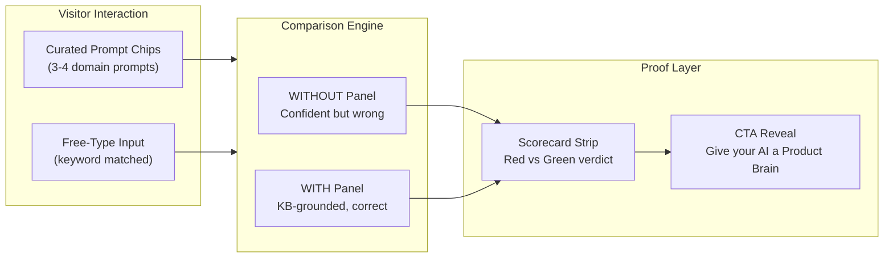

# First Time Good -- The Interactive Showcase

Full pitch document: [marketing/pitches/first-time-good-showcase.md](marketing/pitches/first-time-good-showcase.md)

## What We're Building

Replace the current auto-playing comparison demo in [marketing/product-os-mcp/index.html](marketing/product-os-mcp/index.html) (lines 1618-1686, the `context-demo-section`) with an interactive sandbox that lets visitors choose prompts and watch the before/after play out in real time. No LLM calls -- all pre-rendered. Zero per-visitor cost.

## Key Architecture Decisions

- **Vanilla HTML/CSS/JS** -- matches existing single-file marketing page pattern. No framework, no build step.
- **Pre-rendered responses** -- all 3-4 prompt/response pairs are authored as static JSON inlined in the HTML. Typewriter effect reveals pre-existing content progressively.
- **Fake free-type** -- keyword matching maps arbitrary input to the nearest curated scenario. Unmatched input nudges users toward the curated chips.
- **Mobile: tab-toggle** -- below 768px, the side-by-side becomes "Without" / "With" tabs. Scorecard strip stays visible.
- **Lazy-loaded** -- IntersectionObserver initializes the demo only when scrolled into view.

## Files Changed

- **Edit:** [marketing/product-os-mcp/index.html](marketing/product-os-mcp/index.html) -- replace the `context-demo-section` (lines 1618-1686) with the new interactive sandbox. Also update the existing demo CSS (lines ~430-680 approx.) and JS (the demo animation logic at the end of the file).
- **Reference:** [marketing/index.html](marketing/index.html) -- brand system (CSS variables, fonts, fade-in pattern) to keep consistent.
- **Reference image:** The side-by-side comparison screenshot is the design target -- the interactive demo should feel like that image came alive.

## Content to Author (3-4 Prompt/Response Pairs)

Each pair needs a "without" response (confident, structured, domain-wrong) and a "with" response (KB-grounded, correct, with entry badges). All in the procurement domain:

- **Prompt 1:** "Add supplier validation to the order form" (mirrors the existing image -- GT-019, BR-012, BR-015)
- **Prompt 2:** "Create the purchase approval workflow" (budget rules, approval chain, department thresholds)
- **Prompt 3:** "Add email notification when inventory drops below reorder point" (inventory terms, reorder-point rules)
- **Prompt 4:** "Validate order totals against department budget rules" (budget governance, spending limits)

## Rabbit Holes (Patched)

- **"Wrong" response calibration** -- use the existing image as the tone template: confident, professional, wrong on domain specifics only
- **Keyword matching for free-type** -- simple map, not ML. Unmatched = friendly redirect to chips
- **Mobile split-screen** -- tab-toggle below 768px
- **Typewriter perf** -- pre-rendered HTML, progressive reveal via CSS clip-path, under 15KB JS
- **Page load** -- lazy-load with IntersectionObserver, no network fetches, response data inlined

## No-Gos

- No real LLM calls or backend
- No multiple domain scenarios (procurement only)
- No standalone page (embedded in existing landing page)
- No user accounts or persistent state
- No framework (vanilla JS/CSS)
